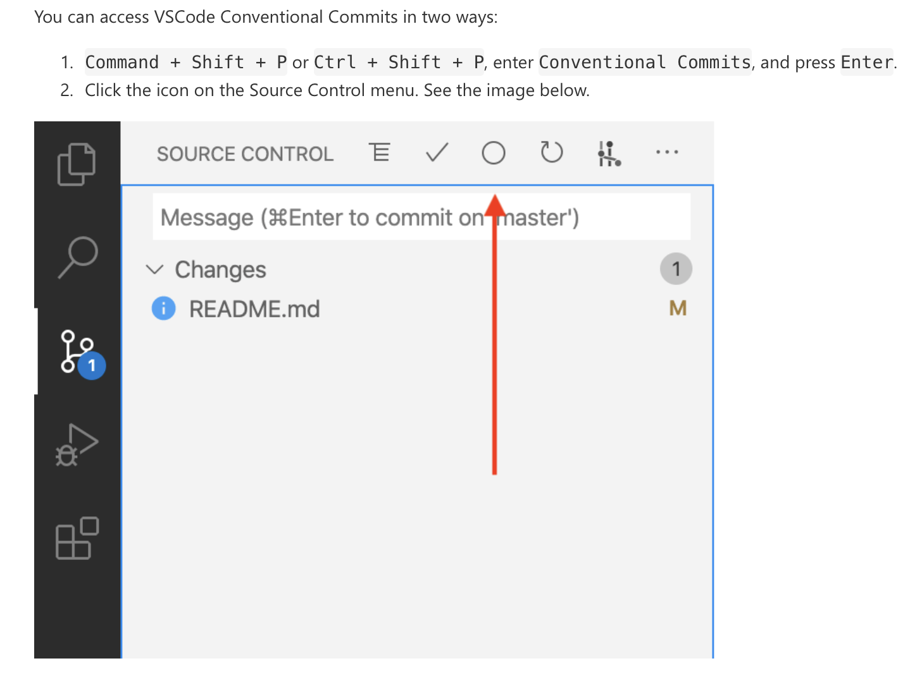

# Contributing

When contributing to this repository, please first discuss the change you wish to make via issue, email, or any other method with the owners of this repository before making a change.

## Development environment setup

To set up a development environment, please follow these steps:

1. Clone the repo

   ```sh
   git clone https://github.com/mkeleti/acm-site
   ```

2. Change directory and install packages

   ```sh
   cd acm-site
   yarn install
   ```

3. Run the dev server

   ```sh
   yarn dev
   ```

4. Make commits often and use conventional commits



5. Use the [figma design](https://www.figma.com/file/jhFCstc5Z3CPgsujQxxMfv/ACM-Website?node-id=0%3A1) as a reference

## Reference Documentation

If you are ever confused you can reference this documentation for each layer in our stack

- [Astro](https://docs.astro.build/en/getting-started/)
- [Svelte](https://svelte.dev/docs)
- [TailwindCSS](https://tailwindcss.com/docs/installation)
- [CSS, HTML, & JS](https://developer.mozilla.org/en-US/)
- [Typescript](https://www.typescriptlang.org/docs/)
- [yarn](https://yarnpkg.com/getting-started)
## Issues and feature requests

You've found a bug in the source code, a mistake in the documentation or maybe you'd like a new feature? You can help us by [submitting an issue on GitHub](https://github.com/mkeleti/acm-site/issues). Before you create an issue, make sure to search the issue archive -- your issue may have already been addressed!

Please try to create bug reports that are:

- _Reproducible._ Include steps to reproduce the problem.
- _Specific._ Include as much detail as possible: which version, what environment, etc.
- _Unique._ Do not duplicate existing opened issues.
- _Scoped to a Single Bug._ One bug per report.

**Even better: Submit a pull request with a fix or new feature!**

### How to submit a Pull Request

1. Search our repository for open or closed
   [Pull Requests](https://github.com/mkeleti/acm-site/pulls)
   that relate to your submission. You don't want to duplicate effort.
2. Fork the project
3. Create your feature branch (`git checkout -b feat/amazing_feature`)
4. Commit your changes (`git commit -m 'feat: add amazing_feature'`) ACM@KU Website uses [conventional commits](https://www.conventionalcommits.org), so please follow the specification in your commit messages.
5. Push to the branch (`git push origin feat/amazing_feature`)
6. [Open a Pull Request](https://github.com/mkeleti/acm-site/compare?expand=1)
